<center><strong style="font-size: 1.8em">摘要</strong></center> 

SysY语言是C语言的一个子集。每个SysY程序的源码存储在一个扩展名为sy的文件中。该文件有且仅有一个名为main的主函数定义，还可以包含若干全局变量声明、常量声明和其他函数定义。SysY语言支持**int类型**和元素为int类型且按行优先存储的**多维数组类型**，其中int型整数为32位有符号数，**const**修饰符用于声明常量。

SysY语言本身没有提供输入/输出(I/O)的语言构造，I/O是以运行时库方式提供，库函数可以在SysY程序中的函数内调用。部分SysY运行时库函数的参数类型**会超出**SysY支持的数据类型，如可以为字符串。SysY编译器能处理这种情况，将SysY程序中这样的参数正确地传递给SysY运行时库。

我们小组编写了一个SysY语言的编译器，能够实现SysY语言的词法分析、语法分析、语义分析、中间代码生成及优化等部分，我们的编译器能够根据给定的程序输入输出正确的中间代码。


# SysY语言编译器

编译生成编译器：

```shell
git clone https://gitlab.eduxiji.net/aison/mycompiler.git
cd mycompiler
make & make clean
```

使用编译器(目前完成前端部分，输出结果为语法树、语义分析结果和中间代码生成结果)

```shell
./compiler_name < [input_file_path]  
```

例如

```c
/* 多行注释测试 */
/**
 * @file    syntaxRight.c
 * @note    这个文件测试SysY语言的所有文法要素, 用于检查生成的文法分析器的正确性。
 *          最终的结果是能够正确解析该文件并输出语法书。有关测试内容在下面给出注释。
 */
/* CompUnit */
/* 全局声明 */
int a;
/* 全局声明与定义初始化 */
int b = 0; 

/* 连续声明与定义初始化 */
int ch = 5, d = 1, e;
/* 多维数组声明 */
int thisIsAnArray[19][20][21];
/* 常量的全局声明 */
const int aa = 2;
const int brr[4] = {1,2,3,4};
const int z[2][2] = {{5}, 8, 9};
/* Function 2, void Return Value, void Parameter */
/* 函数2 返回void 参数也是空*/
void HelloWorld() {
    /* 库函数调用-参见SysY运行时库 */
    //printf("Hello, SysY!");
    
    /* 空返回 */
    return;
}
/* 函数3 多个参数 有int类型返回值 */
int max(int a, int b) {
    // return exp
    return  a;
}
// 函数1
int main() {
    /* 局部变量声明与初始化 */
    int i=0, j, t, controller = 1, condition = 0;
    /**
     *  @note   Statements, Control Flows, Scopes
     **/
    /* 空循环 */
    while (1);
    while (1) { } // 空语句块

    /* 嵌套循环 */
    while ( 1 ) {
        while ( controller ) {
            controller = controller+1;
            /* If-else 语句 */
            if ( controller < 10) 
                continue; // continue语句
            else {
                HelloWorld();
                break;    // break语句
            }
        }
        
    }    
    /* else 悬挂 */
    if ( 1 ) 
        if ( 2 ) i = 333;
        else i = 955;
    else if ( 3 ) i = 666;
    else i = 233;
    /* 语句块嵌套 */
    t = -5;
    {   int t = 6;
        {   int t = 10;
            {   int t = 0;
                t = t * 10;  // 乘除加减模运算 + 赋值
                t = t / 10;
                t = t + 10;
                t = t - 10;
                t = t % 5;
            }
        }
    }
    /* 空 */
    ;;;;;;    
    /**
     *  @note   表达式
     **/

    /* 运算符 */
   
    // 逻辑运算 SysY语言中逻辑运算必须在Cond或while语句中
    if (1 && 2) {
        if (3 || 0) {
            // 比较运算符
            while( i !=0 && j >= 0 ) {
                i = i - 1;
                j = j - 1;
            }
        }
    }
    // 其他的比较运算符
    if (a > 2)
        if (a <10)
            if(a >= 5)
                if(a <= 8)
                    a = 4;
    
    // 单目运算符
    thisIsAnArray[0][0][1] = max(1,2);
    thisIsAnArray[0][0][1];
    -thisIsAnArray[0][0][1];
    (thisIsAnArray[0][0][1]);
    (3+4 * thisIsAnArray[0][0][1]);
   
    /* 运算符优先级 */ 
    // SysY语言文法本身就体现了优先级和结合性
    if(0 && 1) {
        i = 0;
    }
    if (1 || 0) {
        i = 2 - 1 * -1;
    }
    return 0;
}

```


## 第1章 词法分析

### 1.1 Token说明

* Types：`int`，`void`，`const`
* Control Flow：`if`，`else`，`while`，`continue`，`break`
* Function：`return`，`{}`，`;`
* Operators（按优先级）：
  * `()`，`[]` ：括号、下标运算符
  * `!`，`-` ：逻辑非、负号运算符
  * `*`，`/`，`%`：乘法、除法、取余运算符
  * `+`，`-`：加法、减法运算符
  * `<`，`<=`，`>`，`>=`：关系运算符
  * `==`，`!=`：等于、不等于运算符（判断）
  * `&&`：逻辑与运算符
  * `||`：逻辑非运算符
  * `=`：赋值运算符
  * `,`：逗号运算符（把若干表达式组合成一个表达式）


### 1.2 Token定义

Token如下：

```c
// keywords
%token <node> RETURN IF ELSE WHILE CONST VOID BREAK CONTINUE INT

// identifiers and numbers
%token <node> ID INTCONST

// Operators
%token <node> LT GT LTE GTE EQ NEQ PLUS MINUS STAR DIV PERCENT
%token <node> AND OR NOT ASSIGNOP

// Delimeters
%token <node> LP RP LB RB LC RC SEMI COMMA
//            (  )  [  ]  {  }  ;    ,
```

正则表达式定义：

```c
// ID
identifier = [a-zA-Z_][a-zA-Z0-9_]*

// INTCONST
octal_const = 0[0-7]*
decimal_const = [1-9][0-9]*
hexadecimal_const = (0x|0X)[0-9A-F]+

// Comment
single_line_comment = "//".*
multi_line_comment = [/][*][^*]*[*]+([^*/][^*]*[*]+)*[/]
```


### 1.3 Lex实现

我们使用Lex来实现词法分析。Lex源代码主要是一个由正则表达式和相应代码片段组成的表。Lex会将表转换为对应程序，以读取输入流，将输入划分为匹配正则表达式的字符串，并且识别出对应字符串后会执行相应程序片段。Lex是通过生成确定性有限自动机来进行表达式的识别，并且代码片段会按照输入流中出现的字符串对应表达式顺序执行。

考虑后续语法树的生成（详细内容在后文：抽象语法树的设计与实现中给出），在识别出对应的字符串之后，我们会新建并返回相应的结点。举例如下：

```c
"+"         { yylval.node = newNodeOp("PLUS"); return PLUS; }
```

关键字、操作符和分界符的lex代码都与此类似，不再一一列出。

标识符（identifier）和实数（number）有所不同，除了返回对应类型的节点以外，它们还需要另外的操作，例如标识符需要返回标识符名称，实数需要返回对应的值。具体实现如下：

```c
// identifier
[a-zA-Z_][a-zA-Z0-9_]* { 
    yylval.node = newNodeString("ID", yytext); 
    return ID; 
} 
// numbers
{octal_const} {
    int itmp;
    sscanf(yytext, "%o", &itmp);
    yylval.node = newNodeInt("INTCONST", itmp); 
    return INTCONST; 
}
{decimal_const} {
    int itmp;
    sscanf(yytext, "%d", &itmp);
    yylval.node = newNodeInt("INTCONST", itmp); 
    return INTCONST; 
}
{hexadecimal_const} {
    int itmp;
    sscanf(yytext, "%x", &itmp);
    yylval.node = newNodeInt("INTCONST", itmp); 
    return INTCONST; 
}
```

在遇到空白符或注释时则略过不执行操作。


## 第2章 SysY语言文法分析

### 2.1 SysY语言文法说明

首先，具体说明一下SysY语言的文法。

SysY语言文法主要分为**四部分**，分别是**变量/常量声明**，**函数声明**，**语句**，**表达式**。文法的开始符号为CompUnit，表示编译单元。

下面具体展开分析

**变量/常量声明**：

* SysY语言可以在一个变量/常量声明语句中声明**多个**变量或常量
* 声明时可以带**初始化**表达式
* 所有变量/常量要求**先定义再使用**
* 在函数外声明的为**全局变量/常量**
* 在函数内声明的为**局部变量/常量**

**函数**：

* 函数可以**带参数**也可以**不带参数**
* 参数的类型可以是**int**或者**数组类型**
* 函数可以**返回int**类型的值，或者**不返回值**(即声明为void类型)
* 当参数为**int时，按值传递**；而参数为**数组类型时，实际传递的是数组的起始地址**，并且**形参只有第一维可以空缺**
* 函数内部由若干**变量声明和语句**组成

**语句**：

* 语句包括**赋值语句**、**表达式语句**(表达式可以为空)、**语句块**、**if语句**、**while语句**、**break语句**、**continue语句**、**return语句**
* 语句块中可以包含若干变量声明和语句
* 语句块应该由用两个大括号，即 `{`,`}` 包围在一起，这个语句块可以递归的包含其他语句

**表达式**：

* 支持基本的**算数运算**(+、-、*、/、%)、**关系运算**(==、!=、<、>、<=、>=)和**逻辑运算**(!、&&、||)
* 非0表示真、0表示假
* 关系运算或逻辑运算的结果用1表示真、0表示假。
* **算符的优先级和结合性以及计算规则(含逻辑运算的“短路计算”)与C语言一致**。

以上所有支持的文法内容的表现均与C语言一致


下面是一些**典型**的SysY语言不支持的文法相关内容

* *不支持*实现预处理例如**宏**和**include**，即*不能*使用 `#define` 或者`#include`

* 不支持**多文件编译**，这是第一条直接导致的，因此只能使用*一个C源文件*

* *不支持*函数**原型声明**(Function Prototype Declaration)
* *不支持***指针**
* *不支持***三元表达式**，例如不能使用`?:`


### 2.2 SysY语言文法BNF定义

比赛提供的文法为SysY语言的**EBNF**(Extended Backus-Naur Form)范式。由于我们使用的是Yacc来进行文法分析器的生成，而Yacc是LALR分析器的生成器，因此不直接支持EBNF。

实验采用如下方法将EBNF转换为BNF

1. 对于EBNF中的**可选部分(optional)**，将其展开。
   * 例如，CompUnit $$\rightarrow$$ [CompUnit] (Decl | FuncDef) 转换为 CompUnit $$\rightarrow$$ CompUnit Decl | CompUnit FuncDef | Decl | FuncDef

2. 对EBNF中的 **可重复0次或多次(repetition)** 的部分，通过增加一个左递归的产生式来解决
   * 例如，ConstDef $$\rightarrow$$ Ident { '[' ConstExp ']' } '=' ConstInitVal 转换为 ConstDef $$\rightarrow$$ Ident **ConstExp_rep** = ConstInitVal ;    **ConstExp_rep** $$\rightarrow$$ ConstExp_rep '[' ConstExp ']' | $$\epsilon$$

首先展示的是比赛中规定的SysY语言的**EBNF**范式，其中:

* 符号[...]表示方括号内包含的为可选项

* 符号{...}表示花括号内包含的为可重复0次或多次的项

* 终结符或者是由单引号括起的串，或者是Ident、InstConst这样的记号。

  > ​		编译单元 			 	CompUnit $$\rightarrow$$ [CompUnit] (Decl | FuncDef)
  >
  > ​       		声明 			     	      Decl $$\rightarrow$$ ConstDecl | VarDecl
  >
  > ​		常量声明				 ConstDecl $$\rightarrow$$ '**const**' BType ConstDef {',' ConstDef} ';'
  >
  > ​		基本类型					    BType $$\rightarrow$$ '**int**'
  >
  > ​		常数定义		 		 ConstDef $$\rightarrow $$ **Ident** { '[' ConstExp ']' } '=' ConstInitVal
  >
  > ​		常量初值			 ConstInitVal $$\rightarrow$$ ConstExp 
  >
  > ​																| '{' [ ConstInitVal { ',' ConstInitVal } ] '}' 
  >
  > ​		变量声明        	     	VarDecl  $$\rightarrow$$ BType VarDef { ',' VarDef } ';'
  >
  > ​		变量定义					   VarDef $$\rightarrow$$ **Ident** { '[' ConstExp ']' } 
  >
  > ​																| **Ident** { '[' ConstExp ']' } '=' InitVal 
  >
  > ​		变量初值					    InitVal $$\rightarrow$$ Exp | '{'[InitVal{','InitVal}]'}'
  >
  > ​		函数定义				     FuncDef $$\rightarrow$$ FuncType **Ident** '(' [FuncFParams] ')' Block
  >
  >    ​		 函数类型				   FuncType $$\rightarrow$$ '**void**' | '**int**'
  >
  > ​	函数形参表 	   	FuncFParams $$\rightarrow$$  FuncFParam { ',' FuncFParam }
  >
  >    ​		 函数形参		 	FuncFParam $$\rightarrow$$ BType **Ident** ['[' ']' { '[' Exp ']' }]
  >
  > ​    	    语句块						 Block $$\rightarrow$$ '{' { BlockItem } '}'
  >
  > ​		语句块项			 	BlockItem $$\rightarrow$$ Decl | Stmt
  >
  > ​			    语句					 	 Stmt $$\rightarrow$$ LVal '=' Exp ';' | [Exp] ';' | Block 
  >
  > ​							   								 | 'if' '( Cond ')' Stmt [ 'else' Stmt ]	
  >
  > ​							   							 	| 'while' '(' Cond ')' Stmt
  >
  > ​							   							 	| 'break' ';' | 'continue' ';'
  >
  > ​							   							 	| 'return' [Exp] ';'
  >
  > ​    	    表达式							Exp $$\rightarrow$$ AddExp 注: SysY表达式是int型表达式
  >
  > ​	条件表达式						 Cond $$\rightarrow$$ LOrExp
  >
  > ​	左值表达式						   LVal $$\rightarrow$$ **Ident** {'[' Exp ']'} 
  >
  > ​	基本表达式		  	PrimaryExp $$\rightarrow$$ '(' Exp ')' | LVal | Number
  >
  > ​               数值					Number $$\rightarrow$$ **IntConst**
  >
  > ​    一元表达式			 	UnaryExp $$\rightarrow$$ PrimaryExp | **Ident** '(' [FuncRParams] ')'
  >
  > ​														   	| UnaryOp UnaryExp
  >
  > ​    单目运算符			      UnaryOp $$\rightarrow$$ '+' | '−' | '!'   注: '!' 仅出现在条件表达式中
  >
  > ​    函数实参表		 FuncRParams $$\rightarrow$$ Exp{','Exp}
  >
  > 乘除模表达式				    MulExp $$\rightarrow$$ UnaryExp | MulExp ('*' | '/' | '%') UnaryExp
  >
  > ​    加减表达式				   AddExp $$\rightarrow$$ MulExp | AddExp ('+' | '−') MulExp	
  >
  > ​    关系表达式				     RelExp $$\rightarrow$$ AddExp | RelExp ('<' | '>' | '<=' | '>=') AddExp
  >
  > 相等性表达式				      EqExp $$\rightarrow$$ RelExp | EqExp ('==' | '!=') RelExp
  >
  > 逻辑与表达式				 LAndExp $$\rightarrow$$ EqExp | LAndExp '&&' EqExp
  >
  > 逻辑或表达式				    LOrExp $$\rightarrow$$ LAndExp | LOrExp '||' LAndExp
  >
  > ​    常量表达式				ConstExp $$\rightarrow$$ AddExp 	注: 使用的Ident必须是常量


下面展示的是实验中用到**经过修改转换的BNF文法产生式**

```C
// 实验中使用到的BNF文法产生式
             CompUnit:                  CompUnit Decl 
                                        | CompUnit FuncDef
                                        | Decl 
                                        | FuncDef 
                 Decl                   : ConstDecl 
      	 				| VarDecl
            ConstDecl                   : CONST FuncType ConstDef ComConstDef_rep SEMI 
      ComConstDef_rep                   : ComConstDef_rep COMMA ConstDef 
                                        | /*empty*/	  
             ConstDef                   : ID ConstExp_rep ASSIGNOP ConstInitVal 
         ConstExp_rep                   : ConstExp_rep LB ConstExp RB 
                                        | /* empty */
         ConstInitVal                   : ConstExp 
                                        | LC ConstInitVal ComConstInitVal_rep RC 
                                        | LC RC 
  ComConstInitVal_rep                   : ComConstInitVal_rep COMMA ConstInitVal  
					| /*empty*/		
              VarDecl                   : FuncType VarDef ComVarDef_rep SEMI 
        ComVarDef_rep                   : ComVarDef_rep COMMA VarDef 
                                        | /*empty*/
               VarDef                   : ID ConstExp_rep  
                                        | ID ConstExp_rep ASSIGNOP InitVal 
              InitVal                   : Exp 
                                        | LC InitVal ComInitVal_rep RC 
                                        | LC RC
       ComInitVal_rep                   : ComInitVal_rep COMMA InitVal  
                                        | /*empty*/ 
              FuncDef                   : FuncType ID LP FuncFParams RP Block  
                                        | FuncType ID LP RP Block	
             FuncType                   : VOID 
                                        | INT  
          FuncFParams                   : FuncFParam ComFuncFParam_rep 
    ComFuncFParam_rep                   : ComFuncFParam_rep COMMA FuncFParam 
                                        | /*empty*/ 
           FuncFParam                   : FuncType ID 
                                        | FuncType ID LB RB LbEXPRb_rep 
          LbEXPRb_rep                   : LbEXPRb_rep LB Exp RB 	
                                        | /*empty*/ 
                Block                   : LC BlockItem_rep RC 
        BlockItem_rep                   : BlockItem_rep BlockItem 
                                        | /*empty*/ 
            BlockItem                   : Decl  
                                        | Stmt	
    
                 Stmt                   : LVal ASSIGNOP Exp SEMI 
                                        | Exp SEMI 
                                        | SEMI	
                                        | Block 
                                        | IF LP Cond RP Stmt ELSE Stmt 
                                        | IF LP Cond RP Stmt 
                                        | WHILE LP Cond RP Stmt 
                                        | BREAK SEMI 
                                        | CONTINUE SEMI 
                                        | RETURN Exp SEMI 
                                        | RETURN SEMI 
                  Exp                   : AddExp 
                 Cond                   : LOrExp	
                 LVal                   : ID Exp_rep 
              Exp_rep                   : Exp_rep LB Exp RB  
                                        | /*empty*/ 
           PrimaryExp                   : LP Exp RP  
                                        | LVal
                                        | Number 
               Number                   : INTCONST
             UnaryExp                   : PrimaryExp  
                                        | ID LP FuncRParams RP 
                                        | ID LP RP 
                                        | UnaryOp UnaryExp 
              UnaryOp                   : PLUS 
                                        | MINUS 
                                        | NOT       
          FuncRParams                   : Exp comExp_rep 
           comExp_rep                   : comExp_rep COMMA Exp 
                                        | /*empty*/ 
    
               MulExp                   : UnaryExp 
                                        | MulExp STAR UnaryExp 
                                        | MulExp DIV UnaryExp 
                                        | MulExp PERCENT UnaryExp 
               AddExp                   : MulExp 
                                        | AddExp PLUS MulExp 
                                        | AddExp MINUS MulExp 

               RelExp                   : AddExp
                                        | RelExp LT AddExp 
                                        | RelExp GT AddExp 
                                        | RelExp LTE AddExp 
                                        | RelExp GTE AddExp 
     
                EqExp                   : RelExp
                                        | EqExp EQ RelExp 
                                        | EqExp NEQ RelExp 
              LAndExp                   : EqExp 
                                        | LAndExp AND EqExp 
               LOrExp                   : LAndExp 
                                        | LOrExp OR LAndExp 
             ConstExp                   : AddExp 
```


### 2.3 抽象语法树的设计与实现

在有了良好定义的文法后，下一步就是将其转换为良好组织的抽象语法树。抽象语法树将在编译器的后面阶段发挥重要作用。

**抽象语法树结点设计**

```c
typedef struct Node {
    int lineNo;
    char name[16];
    char value[32];
    int int_val;
    struct Node *child;
    struct Node *next;
    struct Node *father; // used in sdt parse
}treeNode;
```

其中lineNo用于记录语句的行号，name用于记录结点在产生式中的名字(对应的非终结符的名字)，value用于记录ID(标识符，例如变量名、函数名等)的内容，int_val用于记录常量数值。

抽象语法树采用了左孩子右兄弟的构造方法。同时有记录父亲结点的指针，用于语义分析。

程序提供抽象语法树输出接口printTree()，该函数可以以缩进的形式打印构造好的抽象语法树。其示例输出如下:

源代码

```C
int main() {
    int a = 1;
}
```

语法树输出结果

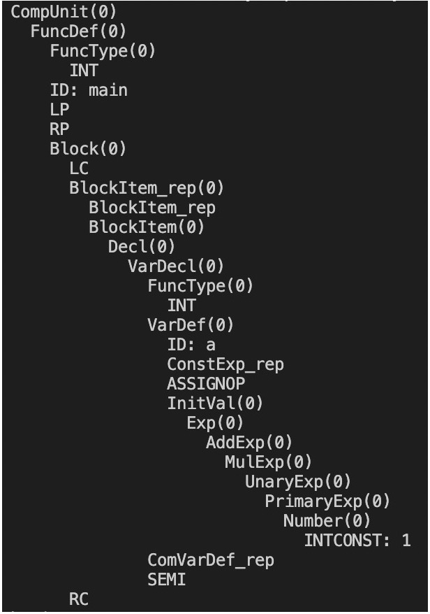

更加详细的内容将在**测试分析**中给出。


------

## 第3章 语义分析

一段语法上正确的源代码仍然可能包含严重的逻辑错误，对编译器的后续工作产生影响，这是我们进行语义分析的原因。语义分析能够帮助我们处理三个方面的内容：

* **上下文相关的内容**，例如变量使用前是否定义、一个函数内部定义的变量在另一个函数中是否允许使用。语法分析阶段的理论基础是上下文无关文法，因此无法处理这样的内容。
* **类型检查**，检查输入程序中的各种行为是否是类型安全的。
* **提供需要提前确定的信息**，例如函数要返回什么类型的值，需要接受多少个参数。

我们实现了符号表以支持语义分析，对语法树进行遍历并进行符号表的相关操作，以及类型的构造与检查。

### 3.1 数据结构

语义分析中的核心数据结构为符号表。在介绍符号表的具体实现之前，我们首先介绍类型、函数、参数数据结构的定义。

#### 3.1.1 类型

SysY语言只有一种基本数据类型：`int`。同时，SysY也支持`const`和多维数组，支持函数返回类型为`void`或者`int`。因此，基本类型`Type`定义如下所示：

```c
typedef struct Type_ *Type;
struct Type_
{
    enum
    {
        basic, 		// for int variables and function return type int
        array,		// for int array variables
        constant,	// for const int variables
        constArray,	// for const int array variables
        empty 		// for function return type void and combine type error
    } kind;
    // for array & constArray
    int size;
};
```

对于数组变量来说，例如定义`int a[2][3][4]`，仅靠一个`Type`显然无法确定具体的维度信息。因此，我们用一个线性链表`List`来表示参数（变量、常量）的类型，以a为例，表示如下：

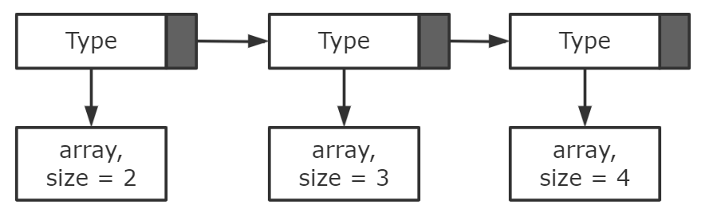

非数组参数也可以用线性链表表示，只是链表只有一项。因此在参数项中，参数类型是使用线性链表`List`来表示的。

#### 3.1.2 参数

参数项`paraItem`定义如下，包含参数名称、参数类型、参数值、作用域层数、对应中间代码的`operand`。

```c
struct paraItem //参数（变量、常量）
{
    char name[16];  //参数名
    List type;      //参数类型
    int *const_val; //常数组中的值，高维数组用一维数组存储
    int scope;      //作用域层数
    Operand op;     //对应的中间代码operand
};
typedef struct paraItem *Para;
```

由于参数有单一实数也有数组，参数值用`int *`实现，单一实数则直接指向对应值，数组统一用一维数组的形式存储。作用域层数和`operand`会分别在符号表、中间代码部分说明，此处不多赘述。

#### 3.1.3 函数

SysY语言的函数定义与c语言类似，但返回类型限制在`void`和`int`，所以用基本类型就能表示。函数项`funcItem`定义如下，包含函数名称、所在行号、返回类型、参数个数和形参表。

```c
struct funcItem //函数
{
    char name[16];
    int lineno;
    Type retType;       //返回类型
    int paraNum;        //参数的个数
    vector paraList;    //形参表
};
typedef struct funcItem *Func;
```

#### 3.1.4 符号表

我们分别建立两个符号表：参数表和函数表。前者用于存储所有定义的变量和常量，后者用于存储所有定义的函数，其中参数表的实现支持了多层**作用域**。符号表的主要结构用**哈希表**实现，我们定义了自己的hash函数，当哈希表出现冲突的时候，通过在相应数组元素下面挂一个链表的方式解决。

自定义hash函数如下所示：

```c
int myHash(char *key) //自定义hash函数
{
    int res = 0, p = 1, i;
    for (i = 0; i < strlen(key); i++)
    {
        res = (res + key[i] * p % HT_SIZE) % HT_SIZE;
        p = p * HT_SEED % HT_SIZE;
    }
    return res;
}
```

在实际应用中，每次查询符号表要匹配的是最近出现过的同名符号，因此每次插入元素会插在链表的开头。哈希表结构如下所示：

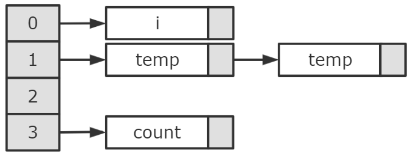

函数表用此结构即可，参数表还需要实现作用域，在后文详细阐述。

##### 3.1.4.1 函数表

函数表的主要用途有两点：

* 函数声明时，检查函数名是否定义过或者与关键字重复，如果没有，则将新函数插入函数表，否则报错；
* 函数调用时，检查函数名是否定义过，如果有，返回相应的`Func`结构，否则报错。

定义函数表如下：

```c
List funcTable[HT_SIZE]; 
```

由上面的用途可以看出，函数表主要涉及查询和插入。实现对应接口如下：

```c
Func querySymTable_func(char* name);	// 查询到对应函数则返回对应Func，否则返回NULL
int insertSymTable_func(Func r);		// 成功插入函数返回0，否则返回1
```

##### 3.1.4.2 参数表

对于参数来说，编译器还需要支持多层作用域。在前面的哈希表结构基础上，我们实现了如下所示的数据结构以支持scope：

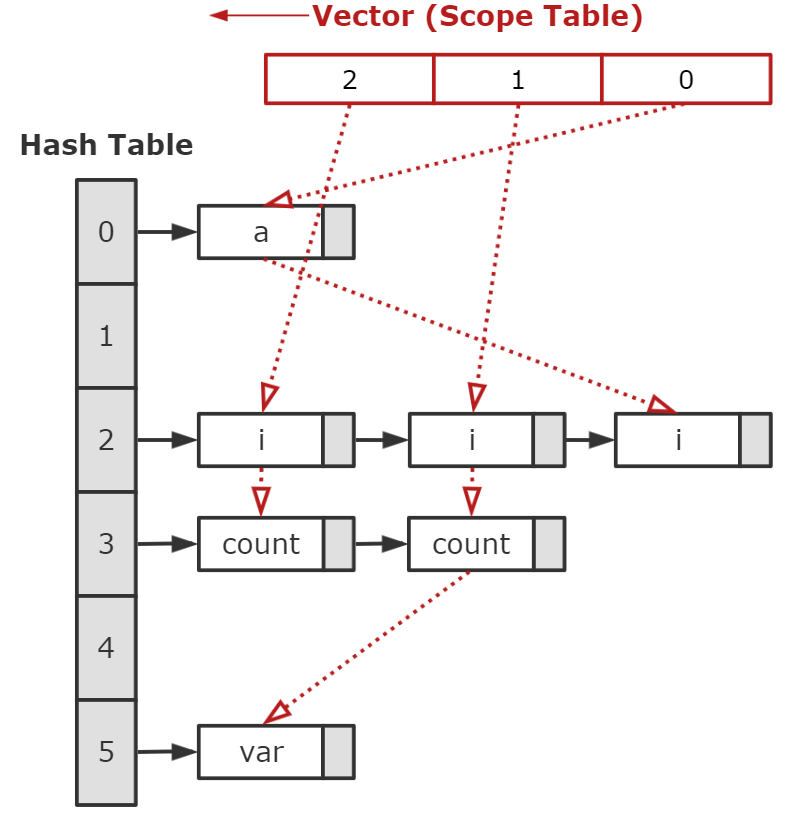

其中每个作用域在图上画成了红色的链表结构，实际上也是用`vector`实现，这里只是为了方便表示。

定义全局变量scope，初始化为0，参数表涉及以下功能：

* 进入一个作用域时，新建 `vector`并加入`Scope Table`，全局变量`scope`加1；
* 参数声明时，检查参数名是否**在当前作用域**定义过或者与关键字重复，如果没有，则将新参数加入哈希表，同时把链表节点加入当前作用域的`vector`，否则报错；
* 参数调用时，检查参数名是否定义过，如果有，返回相应的`Para`结构，否则报错；
* 离开一个作用域时，将当前作用域下所有参数的链表节点移除，在`Scope Table`中删除，全局变量`scope`减1。

实现对应接口如下：

```c
void addScope();		// 进入作用域
void exitScope();		// 离开作用域
Para querySymTable_para(char* name);	// 查询参数表
int insertSymTable_para(Para r);		// 插入参数表
void insertScopeItem(listNode r);		// 链表节点插入作用域，插入参数表时调用
```


### 3.2 具体实现

从root开始对语法树进行遍历，并进行符号表的相关操作，实现类型的构造与语义检查。

#### 3.2.1 参数定义（非数组）

参数定义需要检查是否有重复定义，并把参数插入符号表。这里仅讨论**非数组定义**，数组会在后文阐述。

若参数名在**当前作用域**定义过或者与关键字重复，则报错，否则：

* 新建并分配内存给`Para`结构；
* 设置参数名、参数类型和作用域；
* 分配内存给参数值指针`const_val`，解析并填入参数值；
* 将`Para`插入符号表。

#### 3.2.2 数组定义

数组定义的过程与其他参数定义基本相同，但还需要以下两个工作：

* **维数解析**。例如定义`int a[2][3]`，需要通过`[2][3]`解析出维数对应的类型，在前文3.1.1已经说明类型定义。

* **值解析**。非数组定义只需要一个数值，但在SysY语言中，数组初值有多种情况，以`int a[3][2]`为例：

  * 所有元素初始为0：`int a[3][2] = {};`

  * 与数组维数和各维长度完全对应的初始值，例如：

    * `int a[3][2] = {1, 2, 3, 4, 5, 6};`
    * `int a[3][2] = {{1, 2}, {3, 4}, {5, 6}};`
    * `int a[3][2] = {1, 2, {3, 4}, 5, 6};`

  * `{}`括起来的初始值比对应维数少，隐式初始化，例如：

    * `int a[3][2] = {{}, {3}, 5, 6};` 

    上文会将`a[3][2]`初始化为`{{0, 0}, {3, 0}, {5, 6}}`。

##### 3.2.2.1 维数解析

对于多维数组类型解析，如`int a[2][3][4]`，需要构造出3.1.1图片所示的链表`List`。`[2][3][4]`部分的产生式如下：

```c
// LB = '[', RB = ']'
constExp_rep -> constExp_rep LB ConstExp RB // for const array
Exp_rep -> Exp_rep LB Exp RB // for array
```

解析`Exp_rep`得到类型`List`的过程如下，`constExp_rep`基本相同：

* 新建基础类型`Type`并分配内存，设置`kind`。
* 解析最后一维的`Exp`得到`size`。
* 将`Type`加到`List`头部，解析前面的`Exp_rep`，重复此过程，直到变成NULL。

##### 3.2.2.2 值解析

SysY语言的数组定义初始化比较灵活，语义分析的重点在于两点：

* 大括号嵌套层数不多于定义维数
* 每一维的元素个数不多于对应维的元素个数

我们对这部分语法树进行深度优先搜索，过程中记录当前处于第几层`index`，已经初始化的元素个数`count`，到本层为止最多多少元素`limit`。搜索时可能会遇到左括号`{`、右括号`}`或者元素`number`，分别处理如下：

* `{`：
  * 检查`index+1`是否超过数组维数；如果`count`不是下一层size的倍数，则需要隐式初始化，更新`count`；检查`count`是否超过`limit`；
  * `index`更新为`index+1`，`limit`更新为`count`加上下一层需要的元素个数，递归调用分析。
* `}`：
  * 如果`count`不是本层size的倍数，需要隐式初始化，更新`count`。
* `number` ：
  * 检查`count`是否超过`limit`；
  * 将对应位置的地址赋值，`count++`。

#### 3.2.3 函数定义

函数定义框架也和参数定义类似，需要检查是否有重复定义，并把函数`Func`插入符号表，不再赘述。我们用`vector`结构存储函数的形参，这里的重点在形参表中**有多维数组**时的处理。

SysY语言中，函数形参是多维数组时第一维会留空，例如`void f(a[][2])`，则`a`可以匹配`x*2`大小的数组。所以这里形参数组的维数类型也要具体记录下来，和参数定义的维数解析类似，只不过第一维的维数没有限制，`size`写成`-1`。

#### 3.2.4 函数调用

函数调用需要检查函数是否被定义，**实参类型是否与形参对应**。前者只需要查询函数表即可，后者需要将实参表和形参表比对参数类型，有两种情况：

* 形参是数值

  若实参也是一个简单数值，则匹配。若实参形如`a[2][3]`，则要检查它是定位到元素，即方括号个数和数组变量的维数相同。这里如果`a`是二维，则匹配。

* 形参是多维数组

  形参是多维数组时需要具体检查每一维是否匹配。例如`void f(a[][2])`，则`a`可以匹配`x*2`大小的数组，若有`int temp[4][3][2][2]`，则`temp[1][1]`就是`2*2`的数组，可以匹配。因此需要以下处理：

  * **得到实参所取的数组维数。**就上文例子来说，原变量`temp`类型`List`形如：`4->3->2->2`，调用`temp[1][1]`解析得到`List`形如`1->1`，即可得到`temp[1][1]`实际上对应的类型为`2->2`。实现接口：

    ```c
    List combineType(List defType, List callType);
    ```

  * **检查维数是否匹配**。接上例子，检查`a[][2]`和`2->2` 的维数可以匹配即可，即第一维忽略，后面的`size`完全相同。

#### 3.2.5 左值处理

左值`LVal`有两种情况：

* 作为实参在**函数调用**时使用
* 作为左值在**赋值语句**使用，形如`LVal '=' Exp; `

其中，`LVal`只有在**函数调用**才能是多维数组，在**赋值语句**只能是非数组变量，或者定位到数组元素。因此在分析`LVal`时，需要一个flag判断属于哪种情况。

前者需要检查和形参是否匹配，分析办法在函数调用部分已经说明；后者只需要确定`LVal`对应的变量有定义且是数值即可。

#### 3.2.6 循环语句

由于`break`和`continue`语句只有在循环语句的`block`中出现，所以这里需要特殊处理。定义全局变量`whileCnt`，在遇到`while`循环时+1，在离开时-1。所以如果分析到`break`或`continue`，检查`whileCnt`是否大于0即可。


### 3.3 错误处理

根据以上的语义分析过程，我们一共处理26种不同的语义错误：

| error num | reason                                         | info                                                         |
| --------- | ---------------------------------------------- | ------------------------------------------------------------ |
| 1         | 定义常量/变量类型不能是void                    | storage size of this variable isn't known                    |
| 2         | 除运算和模运算的被除数不能是0                  | division by zero                                             |
| 3         | 函数不能在常量表达式中调用                     | function cannot be called in a constant expression, because the return value of a function is a variable |
| 4         | 数组的维度必须是正数                           | size of array is negative                                    |
| 5         | 声明数值变量，初始化类型是数组                 | excess elements in scalar initializer                        |
| 6         | 声明数组变量，初始化类型是数值                 | invalid initializer                                          |
| 7         | 变量还未声明                                   | the variable has't been defined                              |
| 8         | 数组变量初始化，大括号嵌套层数超过数组维数     | too many braces around scalar initializer                    |
| 9         | 需要是const的地方类型不是const                 | const type variable is required here                         |
| 10        | 数组变量初始化，同一维度元素数量超过限制       | excess elements in scalar initializer                        |
| 11        | 变量/常量/函数声明时和保留字重名               | an identifier can not be the same as reserve names           |
| 12        | 变量/常量/函数重复定义                         | repeated definition                                          |
| 13        | continue或者break语句不在循环体内              | the continue/break statement is not in while loop            |
| 14        | '!'只能出现在条件表达式                        | NOT '!' operation can only appear in condition expressions   |
| 15        | 函数实参和函数形参类型有出入                   | the actual parameter type is different from the formal parameter type defined by the function |
| 16        | 函数声明时形参类型不能是void                   | function parameter type cannot be void                       |
| 17        | return类型和函数返回类型对不上                 | the return type is different from the return type defined by the function |
| 18        | 左值作为函数实参调用，调用不合法               | when lvalue is passed as a function argument, the reference of the array variable is illegal |
| 19        | 左值作为赋值语句调用，下标越界                 | subscript out of bounds                                      |
| 20        | 左值作为函数实参调用，应该传入数组，输入是数值 | lvalue passed as a function argument here should be an array/constarray. |
| 21        | 左值作为赋值语句调用，必须取到一个元素         | the lvalue in the assignment statement can only be a non-array variable, or locate an array element. |
| 22        | 函数声明无参数，调用时传入参数                 | too many function arguments                                  |
| 23        | 函数调用时参数过多                             | too many function arguments                                  |
| 24        | 函数调用时未定义                               | the function has't been defined                              |
| 25        | 函数调用时缺少参数                             | missing function arguments                                   |

遇到语义错误不会立即停止程序，而是继续分析直到分析完成，从而能够尽可能多的找到语义错误。记录语义错误数量，大于0则不继续做中间代码生成。


## 第4章 中间代码生成

### 4.1 名词解释

中间代码（Intermediate Representation, IR）是目标代码的一种精简的形式化表达，它不仅将编译器的编写划分成前端和后端两大部分，更重要的是成为各种各样的源代码和目标代码之间的桥梁，当源代码、目标代码、目标体系架构以及运行时环境种类非常繁多的时候，相比于对于每一种源代码和目标环境之间都构造一种编译器，采用中间代码作为中介就可以大大减少需要的编译器的数目，从而减少工作量。

根据和目标代码的相近程度，中间代码可以被分为许多不同的等级。常用的中间代码有P-Code、Three-Address Code等。中间代码生成则是以抽象语法树（Abstract Syntax Tree, AST）为输入，产生中间代码的过程。


### 4.2 中间代码定义

本实验采用的中间代码定义如下：

```
LABEL x :               定义标号x
FUNCTION f:             定义函数f
x := y                  赋值操作
x := y + z              加法操作
x := y - z              减法操作
x := y * z              乘法操作    
x := y / z              除法操作
x := y % z              模除操作
x := &y                 取y的地址赋给x
x := *y                 取以y值为地址的内存单元的内容赋给x
*x := y                 取y值赋给以x值为地址的内存单元
GOTO x                  无条件跳转至标号x
IF x [relop] y GOTO z   如果x与y满足[relop]关系则跳转至标号z
RETURN x                退出当前函数并返回x值
DEC x [size]            内存空间申请, 大小为4的倍数
ARG x                   传实参
x := CALL f             调用函数, 并将其返回值赋给x
PARAM x                 函数参数申明
```

**解释：**

1. 标号语句LABEL用于指定跳转目标，注意LABEL与x之间、x与冒号之间都被空格或制表符隔开。
2. 函数语句FUNCTION用于指定函数定义，注意FUNCTION与f之间、f与冒号之间都被空格或制表符隔开。
3. 赋值语句可以对变量进行赋值操作（注意赋值号前后都应由空格或制表符隔开）。赋值号左边的x一定是一个变量或者临时变量，而赋值号右边的y既可以是变量或临时变量，也可以是立即数。如果是立即数，则需要在其前面添加“#”符号。例如，如果要将常数5赋给临时变量t1，可以写成t1 := #5。
4. 算术运算操作包括加、减、乘、除四种操作（注意运算符前后都应由空格或制表符隔开）。赋值号左边的x一定是一个变量或者临时变量，而赋值号右边的y和z既可以是变量或临时变量，也可以是立即数。如果是立即数，则需要在其前面添加“#”符号。例如，如果要将变量a与常数5相加并将运算结果赋给b，则可以写成b := a + #5。
5. 赋值号右边的变量可以添加“&”符号对其进行取地址操作。例如，b := &a + #8代表将变量a的地址加上8然后赋给b。
6. 当赋值语句右边的变量y添加了“*”符号时代表读取以y的值作为地址的那个内存单元的内容，而当赋值语句左边的变量x添加了“*”符号时则代表向以x的值作为地址的那个内存单元写入内容。
7. 跳转语句分为无条件跳转和有条件跳转两种。无条件跳转语句GOTO x会直接将控制转移到标号为x的那一行，而有条件跳转语句（注意语句中变量、关系操作符前后都应该被空格或制表符分开）则会先确定两个操作数x和y之间的关系（相等、不等、小于、大于、小于等于、大于等于共6种），如果该关系成立则进行跳转，否则不跳转而直接将控制转移到下一条语句。
8. 返回语句RETURN用于从函数体内部返回值并退出当前函数，RETURN后面可以跟一个变量，也可以跟一个常数。
9. 变量声明语句DEC用于为一个函数体内的局部变量声明其所需要的空间，该空间的大小以字节为单位。这个语句是专门为数组变量和结构体变量这类需要开辟一段连续的内存空间的变量所准备的。例如，如果我们需要声明一个长度为10的int类型数组a，则可以写成DEC a 40。对于那些类型不是数组或结构体的变量，直接使用即可，不需要使用DEC语句对其进行声明。另外，在中间代码中不存在作用域的概念，因此不同的变量一定要避免重名。
10. 与函数调用有关的语句包括CALL、PARAM和ARG三种。其中PARAM语句在每个函数开头使用，对于函数中形参的数目和名称进行声明。例如，若一个函数func有三个形参a、b、c，则该函数的函数体内前三条语句为：PARAM a、PARAM b和PARAM c。CALL和ARG语句负责进行函数调用。在调用一个函数之前，我们先使用ARG语句传入所有实参，随后使用CALL语句调用该函数并存储返回值。仍以函数func为例，如果我们需要依次传入三个实参x、y、z，并将返回值保存到临时变量t1中，则可分别表述为：ARG z、ARG y、ARG x和t1 := CALL func。注意ARG传入参数的顺序和PARAM声明参数的顺序正好相反。ARG语句的参数可以是变量、以#开头的常数或以&开头的某个变量的地址。注意：当函数参数是数组时，ARG语句的参数为数组的地址（即以传引用的方式实现函数参数传递）。


### 4.3 数据结构定义

为了表示并储存中间代码，我们定义了以下数据结构：

```c
typedef struct ArgList_* ArgList;     // 函数实参链表
typedef struct Variable_* Variable;   // 变量
typedef struct Operand_* Operand;     // 操作数
typedef struct InterCode_* InterCode; // 中间代码节点
typedef struct CodeList_* CodeList;   // 中间代码链表


struct Operand_{
    enum{
        OP_VARIABLE,  // 变量
        OP_CONSTANT,  // 常量
        OP_ADDRESS,   // 地址
        OP_LABEL,     // 标签
        OP_TEMP       // 暂时变量
    } kind;
    union{
        int var_no;   // 变量序号
        int label_no; // 代码label序号
        int val;      // 用于常数
        int temp_no;  // 暂时变量序号  
    }u;   //这些的作用就是作为唯一标示--每一个变量都是不同名的--从而解决作用域问题
};

struct InterCode_{
    enum{
        IR_ASSIGN,  // x := y 
        IR_LABEL,   // LABEL x :
        IR_PLUS,    // x := y+z
        IR_MINUS,   // x := y-z
        IR_MUL,     // x := y*z
        IR_DIV,     // x := y/z
        IR_MOD,     // x : = y%z 
        IR_FUNC,    // FUNCTION f :
        IR_GOTO,    // GOTO x
        IR_IFGOTO,  // IF x [relop] y GOTO z 
        IR_RET,     // x = *y
        IR_DEC,     // DEC x [size] 内存空间申请-大小为4的倍数 用于数组
        IR_ARG,     // ARG x
        IR_CALL,    // x := CALL f
        IR_PARAM,   // PARAM x
        IR_READ,    // 不用
        IR_WRITE,   // 不用
        IR_RETURN,  // RETURN x
        IR_CHANGE_ADDR, // *x := y 取y值以赋给x值为地址的内存单元
        IR_GET_ADDR     // x := &y 取y的地址赋给x
        } kind;
    union{
        Operand op;
        char *func;
        struct{Operand right, left; } assign; // 赋值 x := y
        struct{Operand result, op1, op2; } binop; // 双目 x := y + z
        struct{Operand x, y, z; char *relop;} if_goto; // IF x [relop] y GOTO z
        struct{Operand x; int size;} dec;         // DEC x [size]
        struct{Operand result; char *func;} call; // x := CALL f
    }u;
};

// 中间代码链表
struct CodeList_{
    InterCode code;
    CodeList prev, next;
};
```

**解释：**

1. `Operand`用于保存每一条中间代码涉及的操作数、常数、标识代码位置的Label等。`kind`储存`Operand`的分类，`u`则储存对应的编号。**按照用途，`Operand`可以分为变量、常量、地址、Label标签、临时变量五种。**其中：

   - 变量（`OP_VARIABLE`）主要用于表示非临时变量的变量，在中间代码中会被表示为`v1`、`v2`、......。对应地，`u`中的`var_no`储存变量的编号。
   - 常量（`OP_CONSTANT`）主要用于表示常数（立即数），在中间代码中会被表示为`#5`、`#7`、......。对应地，`u`中的`val`储存变量的编号。
   - 地址（`OP_ADDRESS`）和变量类似，但主要用于储存数组指针，与普通变量区分开来是为了便于分配空间与程序处理。
   - 标签（`OP_LABEL`）主要用于记录程序中的Label标签（主要用于跳转）。`u`中的`label_no`储存label的编号。
   - 临时变量（`OP_TEMP`）主要用于表示临时变量，在中间代码中会被表示为`t1`、`t2`、......。对应地，`u`中的`temp_no`储存变量的编号。

   **为了保证变量（常量、地址、标签等）之间互不冲突，我们规定IR生成部分中，所有的Operand都是不一样的，即每个变量（常量、地址、标签等）与某个Operand唯一对应。在目标代码生成中，再根据Operand分配内存或是寄存器，实现复用。**

2. `Intercode`用于保存每一条中间代码的具体内容，`kind`是中间代码的类型，`u`中存储中间代码的操作数，根据代码类型的不同，每一条中间代码可能具有1-3个操作数。

3. `CodeList`用于储存中间代码链表。这样处理是为了便于优化中间代码，如果在计算中间代码的同时就将中间代码直接输出，那么输出的中间代码就无法被修改和优化了，所以我们可以先把中间代码存在链表中，待优化完成后再进行输出。


### 4.4 问题分析与整体思路

首先，应当明确的是，IR生成部分的输入是通过了符号表类型检查的AST，输出是若干行中间代码。通过遍历输入的抽象语法树，我们可以仿照语义分析中计算属性的方法，来得出每一个节点对应的中间代码。

例如，假设下面是某棵抽象语法树的一部分：

```ada
	   AddExp
     /    |    \
AddExp   ’+‘    MulExp
   |
MulExp
```

根节点`AddExp`拥有两个孩子，分别为`AddExp`和`MulExp`。要想计算根节点对应的IR，我们只需要分别计算它的两个孩子的IR，储存到两个临时变量中，最后生成一条将两个临时变量相加的IR。

上述过程的伪代码如下：

```c
/***
	生成以r为根的子树的中间代码，表达式的最终值储存在t2这个Operand中
***/
CodeList translate_AddExp(TreeNode r, Operand* t2){
    if(r == NULL) return NULL;  
	Node AddExp = r->child[0];  // left child 
    Node MulExp = r->child[2];  // right child
    Node Op = r->child[1]; // Operator
    t0 = new Operand();
    t1 = new Operand();
    CodeList c0 = translate_AddExp(AddExp, &t0);  // generate IR for left sub-tree
    CodeList c1 = translate_MulExp(MulExp, &t1);  // generate IR for right sub-tree
    if(Op->operator == '+')         // plus
    {
        Intercode ir = generate_IR_plus(&t2, &t0, &t1); // generate IR of "t2 := t0 + t1"
        CodeList c2 = new CodeList(ir);     // put the IR above in a code list 
    } else {					    // minus
        Intercode ir = generate_IR_plus(&t2, &t0, &t1); // generate IR of "t2 := t0 - t1"
        CodeList c2 = new CodeList(ir);     // put the IR above in a code list 
    }
    return merge(merge(c0, c1), c2);   // merge codelist c0, c1 and c2 to get the target code list of node r
}
```

可以看到，对`AddExp`这一节点的IR生成经历了左子树生成、右子树生成、所在节点代码生成三个步骤。类似地，所有的`AddExp`类型的节点都可以采用这一翻译模式。

上述分析告诉我们，**每一个种类的抽象语法树节点都可以采用相似的方式（模板）来生成中间代码**，并且这一过程与之前的语法制导翻译（SDT）具有一定的相似性。同时，SDT中的符号表（变量表、函数表）同样可以服务于中间代码部分。由于中间代码生成中，每个变量、常量、数组地址等等都被抽象为了Operand，而且同一个Operand可能在源程序的多个地方被调用，因此我们需要对Operand进行复用。解决的方案是构建符号表时同时插入符号对应的Operand，这样就能保证每个符号与某个Operand唯一对应。

因此，我们采用的基本方法为：对于每一种类型的节点（设类型为`X`），我们只需要调用函数`translate_X`对其进行语法制导翻译，套用一定的模板，将中间代码看做是节点的属性进行计算即可。对于SDT中使用的变量表和函数表，**我们在类型检查结束后仅保留函数表**（因为SysY语言中函数是全局的），**释放变量表**，并在IR的翻译过程中重新构建变量表，构建方法与SDT一致，但在构建的过程中还需要同时插入每一个符号对应的Operand。

下面我们针对一些典型的语法树结构的翻译“模板”进行说明。


### 4.5 模板

#### 4.5.1 基本表达式与常量表达式

基本表达式`Exp`的翻译较为简单，可分为以下几种情况：

- 如果`Exp`生成了一个立即数，则直接新建一个常量Operand，并将该立即数赋给这个常量即可。
- 如果`Exp`生成了一个左值表达式，则需要到符号表中进行查询得出左值表达式的值，再新建一个变量储存该值即可。
- 如果`Exp`生成了四则运算表达式，则先生成参与运算的Operand的中间代码，再生成一条计算表达式的IR即可。
- 条件表达式、赋值表达式也可仿照上一节的例子类似计算。

对于常量表达式，由于已经通过了类型检查，所以常量表达式可以采用与变量表达式相同的方法进行处理。

#### 4.5.2 条件语句和循环语句

SysY中条件语句和循环语句包括if语句、while语句，对于每种类型的语句，我们首先要计算出语句中涉及到的表达式、子语句的值，为此需要分别为其生成中间代码。由于条件语句和循环语句涉及到跳转，我们需要添加一系列label，为了能够根据条件的真假跳转到不同的位置，我们为`translate_Cond`函数添加两个参数`label_true`和`label_false`，将其当做继承属性计算，当条件表达式值为真时跳转到`label_true`的位置，否则跳转到`label_false`的位置。

以带`else`关键字的`if`语句为例。首先生成`label1`, `label2`, `label3`分别表示条件为真时的代码、条件为假时的代码和结束位置。若条件为真，则继续执行`label1`后的代码，否则跳转到`label2`的位置（这里的跳转在`translate_Cond`函数中实现，后文会详细介绍）。 当条件为真时的代码执行完成时，使用`GOTO label3`语句直接跳转到`if`语句结束的位置。

具体的翻译模式如下表所示。

在SysY中，条件语句和循环语句包括`if`语句、`while`语句，翻译模式如下：

| Case Stmt of                  | translate_Stmt(Stmt, label_continue, label_break)            |
| ----------------------------- | ------------------------------------------------------------ |
| IF LP Exp RP Stmt1            | label1 = new_label() <br>label2 = new_label() <br>code1 = translate_Cond(Exp, label1, label2)<br>code2 = translate_Stmt(Stmt1, label_continue, label_break)<br>return code1 + [LABEL label1] + code2 + [LABEL label2] |
| IF LP Exp RP Stmt1 ELSE Stmt2 | label1 = new_label() <br>label2 = new_label() <br>lebel3 = new_label() <br>code1 = translate_Cond(Exp,  label1, label2)<br>code2 = translate_Stmt(Stmt1, label_continue, label_break)<br>code3 = translate_Stmt(Stmt2, label_continue, label_break)<br>return code1 + [LABEL label1] + code2 + [GOTO label3] + [LABEL label2] + code3 + [LABEL label3] |
| WHILE LP Exp RP Stmt1         | label1 = new_label() <br/>label2 = new_label() <br/>lebel3 = new_label() <br/>code1 = translate_Cond(Exp, label2, label3)<br>code2 = translate_Stmt(Stmt1, label1, label3)<br>return  [LABEL label1] + code1 + [LABEL label2] + code2 + [GOTO label1] + [LABEL label3] |

#### 4.5.3 break和continue语句

注意到上表中`translate_Stmt`的参数中新增了两个参数，分别为`label_break`和`label_continue`，我们将其作为继承属性计算，分别表示当循环中遇到`continue`和`break`语句时应当跳转到的位置。`continue`和`break`的初始值都为空，当然，由于输入已经通过了类型检查，所以不会出现访问空地址的情况。当遇到`while`语句时，在翻译子语句时，我们将`label1`和`label3`的值分别赋给`label_break`和`label_continue`，表示循环开始和结束的位置。显然，`break`语句对应的IR为`[GOTO label_break]`，`continue`则对应 `[GOTO label_continue]`。

#### 4.5.4 变量、常量定义

对于不带初始值的变量，变量的定义本身是不需要翻译成IR的，因为普通变量只需要在运行时分配内存即可，无需单独声明。对于带初始值的变量，只需要先生成计算变量初始值的中间代码，然后新建一个变量，并生成一条将变量的初始值赋给该变量的中间代码。

对于常量，由于输入已经通过了类型检查，所以可以按照和变量一样的方法处理。

#### 4.5.5 数组定义

数组的情况则要复杂一些。仿照SDT部分中对数组的处理方式，我们同样采取与其他部分不一样的方法来生成数组的中间代码。

我们对这部分语法树进行深度优先搜索，同样在过程中记录当前处于第几层`index`，已经初始化的元素个数`count`，到本层为止最多多少元素`limit`。搜索时可能会遇到左括号`{`、右括号`}`或者元素`number`，分别处理如下：

* `{`：
  * 如果`count`不是下一层size的倍数，则需要隐式初始化，更新`count`；
  * `index`更新为`index+1`，`limit`更新为`count`加上下一层需要的元素个数，递归调用分析。
* `}`：
  * 如果`count`不是本层size的倍数，需要隐式初始化，更新`count`。
* `number` ：
  * 生成将对应位置的地址赋值的中间代码，并`count++`。由于这里的赋值涉及到数组下标作为左值的赋值，这部分代码的生成可以参考4.5.8节。

其中，隐式初始化可以通过在一开始将数组空间全部置为0来实现，这样在搜索的过程中就不需要再进行对应的操作了。

#### 4.5.6 函数定义

由于在语法分析中已经构建好了函数表，所以对于函数定义的处理较为简单。对于不带参数的函数，只需要声明函数后直接翻译函数后的block即可。对于带参数的函数，还需要在声明函数后声明其参数。由于参数的名称及其类型已经储存在函数表中，翻译时只需要读取函数表中的对应条目，然后依次翻译参数即可。

#### 4.5.7 函数调用

对于无参数的函数，直接查询符号表并生成一条调用该函数的代码即可。对于带函数的参数，我们还需要另外翻译其实参表。定义`arg_list`为函数的实参表，实参表由一系列表达式`Exp`构成，只需要对这些表达式逐个翻译即可。翻译模式如下表所示：（上表为函数调用的翻译模式，下表为函数实参表的翻译模式）

| case UnaryExp of | translate_UnaryExp(UnaryExp, place)                          |
| ---------------- | ------------------------------------------------------------ |
| ID LP RP         | function = lookup(SymTable, ID)<br>return [place := CALL function.name] |
| ID LP Args RP    | function = lookup(SymTable, ID)<br>arg_list = NULL<br>code1 = translate_Args(Args, arg_list)<br>for i = 1 to length(arg_list) code2 = code2 + [ARG arg_list[i]]<br>return code1 + code2 + [place := CALL function.name] |
| ...              | ...                                                          |

| case Args of    | translate_Args(Args, arg_list)                               |
| --------------- | ------------------------------------------------------------ |
| Exp             | t1 = new_temp()<br>code1 = translate_Exp(Exp, t1)<br>arg_list = t1 + arg_list <br>return code1 |
| Exp COMMA Args1 | t1 = new_temp()<br>code1 = translate_Exp(Exp, t1)<br>arg_list = t1 +arg_list<br>code2 = translate_Args(Args1, arg_list)<br>return code1 + code2 |


#### 4.5.8 左值

在SysY中，左值`LVal`对应的语法是`LVal -> ID Exp_rep`，其中`Exp_rep -> Exp_rep LB Exp RB | empty`. **由于函数实参支持传入数组指针，并且支持传入数组的部分维度作为指针**，因此左值也拥有较多的种类。具体而言，左值可以被分为以下几类：

**1. 普通变量/常量**

- **判断条件：**`ID`后无中括号，即`Exp_rep`为空，且`ID`在符号表中为普通变量/常量。
- **解决方案**：从符号表中查询`ID`对应的Operand，并生成一条IR将Operand中的值赋给目标变量。

**2. 数组指针**

数组指针又可分为两类：以数组`a[3][4][5]`为例，第一类是以数组的名字作为指针，即以`a`作为实参；第二类是以数组的部分维度（**但不能是全部维度**）作为指针，如以`a[1]`、`a[1][2]`作为实参。

- **判断条件：**（1）`ID`后无中括号，即`Exp_rep`为空，且`ID`在符号表中为常量数组/变量数组。（2）`ID`后有中括号，`ID`在符号表中为常量数组/变量数组，且中括号的数量小于数组的维数。

- **解决方案**：从符号表中查询`ID`对应的Operand，得到`ID`对应数组的基地址，记为`Base_addr`。由于数组空间在内存中是连续的，我们只需要根据下标结合基地址算出指针对应的位置。例如，仍以数组`a[3][4][5]`为例，要计算`a[1][2]`对应的地址，只需要先算出`a[0]`的大小，即`4*5=20`，然后计算`a[1][0]`，`a[1][1]`的大小，即`5*2=10`（数组最后一维度的大小\*下标）。两者相加，再加上原数组基地址，由此得出`a[1][2]`对应的地址为`Base_addr+30`。

  概括地讲，设要计算`a[i][j][k]`对应的地址，我们可以采用以下的公式进行计算：
  $$
  ADDR(a[i][j][k])=ADDR(a)+\sum_{t=0}^{i-1}sizeof(a[t]) + \sum_{t=0}^{j-1}sizeof(a[i][t])+\sum_{t=0}^{k-1}sizeof(a[i][j][t])
  $$
  上式很容易推广到任意维数组的情况。

**3. 数组元素值**

- **判断条件：**`ID`后有中括号，`ID`在符号表中为常量数组/变量数组，且中括号的数量等于数组的维数。
- **解决方案**：同数组指针的处理方法，但在处理完成后需要增加一步取值操作。具体为：设数组指针对应的地址储存在`t1`中，目标变量为`place`，则需要新增一条中间代码 `[place := *t1]`.


### 4.6 代码优化

目前主要完成了以下几种中间代码的优化

* 冗余跳转的删除
* 删除未被指向的label
* 直接计算常数


#### 4.6.1 冗余跳转的删除

采用`IF_False`的结构进行优化, 从而减少`LABEL`数量。对于单`if`语句的翻译，一般结果如下：

```
IF x [relop] y GOTO label_true ; 
GOTO label_out 
LABEL label_true ; 
code_true ; 
LABEL label_out ;
```

对于`if-else`语句的翻译 一般结果如下

```
IF x [relop] y GOTO label_true ; 
GOTO label_false ;
LABEL label_true ;
code_true ;
GOTO label_out ;
LABEL label_false
code_false ;
LABEL label_out ; 
```

对于单`if`语句, 使用了两个`label`, 对于`if-else`语句, 使用了3个`label`。而采用`if_false`的方式, 对单`if`只需要一个`label`, 对`if-else`只需要两个`label`。 因此该优化就是将原来的if语句通过将内部逻辑区取反的方式转化为`if_false`。

优化后为：

- 单`if`语句 

```
IF x ![relop] y GOTO label_out ;
code_true ;
LABEL label_out ;
```

- `if-else`语句 

```
IF x ![relop] y GOTO label_false ;
code_true ;
GOTO label_out ;
LABEL label_false ;
code_false ;
LABEL label_out 
```

可以看到有三处修改：

1. 将`[relop] `转化为了 `![relop]`, 同时将`label_true`改为了`label_out`或者`label_false`
2. 删除第二条`GOTO`语句
3. 删除第三条`LABEL`语句

同时对于某种条件下可能存在的如下情况 

```
GOTO label1  ; 
LABEL label1 ; 
```

我们可以将这个多余的`GOTO`语句直接删除。

#### 4.6.2 删除未被指向的label

基本思想: 对中间代码双向链表进行遍历; 对`Label`类型的代码, 判断是否会跳转到此`Label`; 若无, 则为未被指向的`label`, 需要删除。

#### 4.6.3 直接计算常数(常量折叠)

基本思想: 对中间代码双向链表进行遍历; 对于计算类型的操作, 判断左右侧是否为常量; 如果均是常量, 则将该代码替换为lhs, rhs计算结果的常量。

#### 4.6.4 替换相同的右部表达式的变量(公共子表达式删除)

例如：` t3 = t1 + t2; t4 = t1 + t2; v2 = t4 + #2; v5 = t3 + t4; `

然后`t4`在其他地方参与运算，这将所有的`t4`都替换成`t3`, 然后删除`t4`的计算语句, 从而减少了不必要的运算。

#### 4.6.5 复制传播

在赋值语句`x=y`之后尽可能用`y`代替`x`。 好处就是后面在目标代码生成的时候更能体现 不需要`x`和`y`在寄存器里面换来换去。


## 第5章 测试用例

### 5.1 Lexer 词法分析器

Token列表已经在[Token定义](#§1.2 Token定义)中给出，我们写了一个包含所有可能tokens的文件用于测试我们的词法分析器。

test_lexer.sh 是我们用于测试语法分析器的脚本。在进入从主文件目录myCompiler下进入testCase/lexTest目录下运行脚本命令如下

```shell
bash lexTest.sh 
```

* **输入**：需要词法分析的文件。注意路径
* **输出**：Tokens(格式为`LexToken(<type>,<value>,<lineno>,<lexops>)`).

测试例子

1. **关键字**

   输入：

   ```
   int void
   if else
   else if
   while
   continue
   break
   return
   const
   ```

   输出：

   

   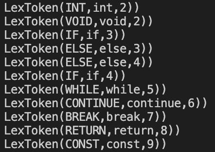

   

   

2. **标识符**

   输入：

   ```
   IAmIdentifier
   I2
   Id_is
   It000
   ```

   输出：

   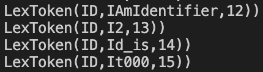

   

3. **常量**

   输入：

   ```
   996 
   007
   0x3E4
   0X3E4
   01744
   ```

   输出：

   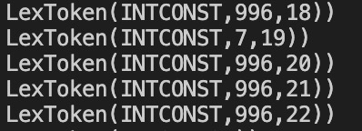

   

   这里数据成功的将十六进制、八进制等都转换为了十进制。

4. 运算符

   输入：	

   ```
   + - * / %
   < > <= >= == !=
   && || !
   =
   ```

   输出

   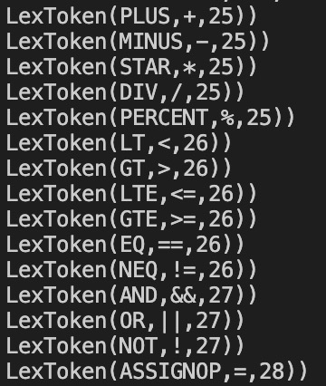

   

5. 分界符

   输入：

   ```
   ( )
   [ ]
   { }
   , ;
   ```

   输出：

   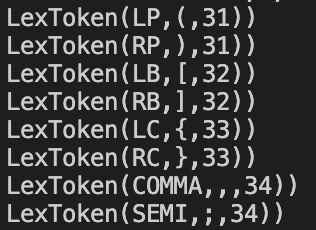

总结，我们编写的lex文件`syntax.l`正确，能够生成预期的词法分析器，完成词法分析任务。测试通过。

printf("LexToken(%s,%s,%d,%d)","",yytext,)


### 5.2 Yacc 文法分析器

SysY语言的文法产生式已经在[SysY语言BNF定义](###§2.2 SysY语言文法BNF定义)中给出。

下面给出相关文法的测试用例。

**输入：**

```C
/* 多行注释测试 */
/**
 * @file    syntaxRight.c
 * @note    这个文件测试SysY语言的所有文法要素, 用于检查生成的文法分析器的正确性。
 *          最终的结果是能够正确解析该文件并输出语法书。有关测试内容在下面给出注释。
 */
/* CompUnit */
/* 全局声明 */
int a;
/* 全局声明与定义初始化 */
int b = 0; 

/* 连续声明与定义初始化 */
int ch = 5, d = 1, e;
/* 多维数组声明 */
int thisIsAnArray[19][20][21];
/* 常量的全局声明 */
const int aa = 2;
const int brr[4] = {1,2,3,4};
const int z[2][2] = {{5}, 8, 9};
/* Function 2, void Return Value, void Parameter */
/* 函数2 返回void 参数也是空*/
void HelloWorld() {
    /* 库函数调用-参见SysY运行时库 */
    //printf("Hello, SysY!");
    
    /* 空返回 */
    return;
}
/* 函数3 多个参数 有int类型返回值 */
int max(int a, int b) {
    // return exp
    return  a;
}
// 函数 1
int main() {
    /* 局部变量声明与初始化 */
    int i=0, j, t, controller = 1, condition = 0;
    /**
     *  @note   Statements, Control Flows, Scopes
     **/
    /* 空循环 */
    while (1);
    while (1) { } // 空语句块

    /* 嵌套循环 */
    while ( 1 ) {
        while ( controller ) {
            controller = controller+1;
            /* If-else 语句 */
            if ( controller < 10) 
                continue; // continue语句
            else {
                HelloWorld();
                break;    // break语句
            }
        }
        
    }    
    /* else 悬挂 */
    if ( 1 ) 
        if ( 2 ) i = 333;
        else i = 955;
    else if ( 3 ) i = 666;
    else i = 233;
    /* 语句块嵌套 */
    t = -5;
    {   int t = 6;
        {   int t = 10;
            {   int t = 0;
                t = t * 10;  // 乘除加减模运算 + 赋值
                t = t / 10;
                t = t + 10;
                t = t - 10;
                t = t % 5;
            }
        }
    }
    /* 空 */
    ;;;;;;    
    /**
     *  @note   表达式
     **/

    /* 运算符 */
   
    // 逻辑运算 SysY语言中逻辑运算必须在Cond或while语句中
    if (1 && 2) {
        if (3 || 0) {
            // 比较运算符
            while( i !=0 && j >= 0 ) {
                i = i - 1;
                j = j - 1;
            }
        }
    }
    // 其他的比较运算符
    if (a > 2)
        if (a <10)
            if(a >= 5)
                if(a <= 8)
                    a = 4;
    
    // 单目运算符
    thisIsAnArray[0][0][1] = max(1,2);
    thisIsAnArray[0][0][1];
    -thisIsAnArray[0][0][1];
    (thisIsAnArray[0][0][1]);
    (3+4 * thisIsAnArray[0][0][1]);
   
    /* 运算符优先级 */ 
    // SysY语言文法本身就体现了优先级和结合性
    if(0 && 1) {
        i = 0;
    }
    if (1 || 0) {
        i = 2 - 1 * -1;
    }
    return 0;
}
```

**语法分析的结果：**可视化语法树(部分)

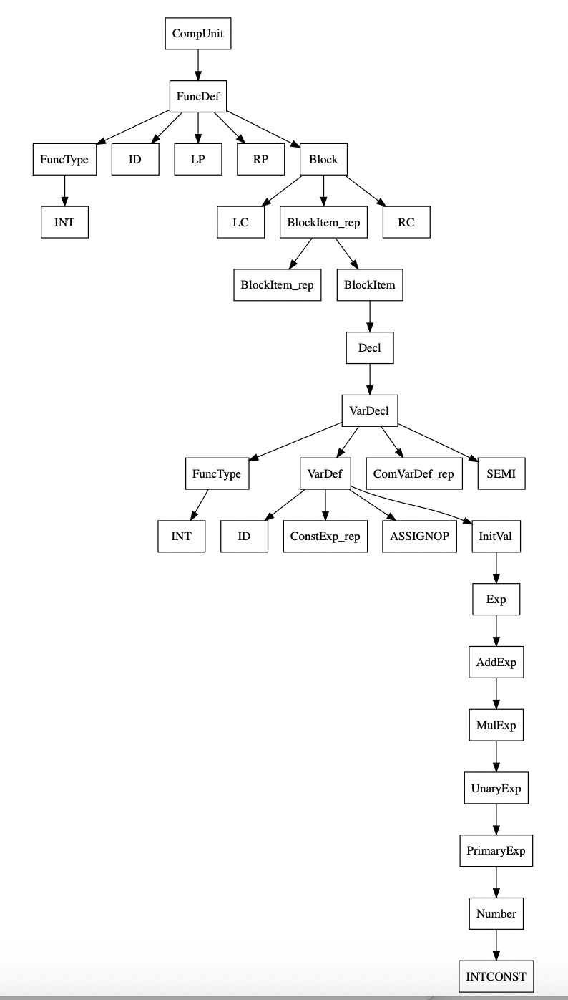


语法树可视化工具采用**graphviz**将**语法树**的**dot文件转换为结构图**([在线转换工具](https://dreampuf.github.io/GraphvizOnline))。

其中将内存中的语法树转换为dot文件的代码在**visast.c**中。


在用我们复杂的测试输入下得到以上复杂的树，我们仔细的检查了输出的每一个部分。结果是**所有的文法成分都按预期解析**，有合理的优先级和结合性。由此，**我们可以论定我们的语法分析程序通过测试**。


### 5.3 语义分析

语义分析部分包括符号表的创建、查找、删除，scope的解析，以及类型检查。

下面给出相关测试用例。

每个用例仅在其中一行含有语义错误。某些语义错误可能会产生连锁反应。

#### 样例1

**输入：**

```C
int get(int x) {
  x2 = 1; // 变量未定义
}
```

**输出：**

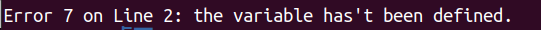


#### 样例2

**输入：**

```C
int cmp(int x, int y) {
  int b = max(x,y);	// 未定义函数
  if(b == x) {
    return 1;
  }
  else 
    return 0;
}
```

**输出：**

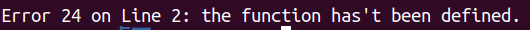


#### 样例3

**输入：**

```C
int Inf() {
  return 10000;
}
int Inf() {
  return -10000;
} // 函数重名
```

**输出：**

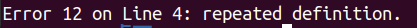


#### 样例4

**输入：**

```C
void func() {
  return 5; //实际返回值类型和声明的返回值类型int不一致
}
```

**输出：**

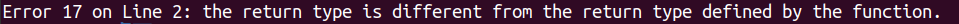


#### 样例5

**输入：**

```C
int maxThree(int a, int b, int c) {
  return a;
}
int main() {
  int b = maxThree(1,2); // 实参数目与形参不符
}
```

**输出：**

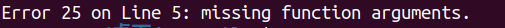


#### 样例6

**输入：**

下面的测试用例包含**多个语义错误**。同一个语义错误可能会有连锁反应。

```C
void x = 1;  // 定义变量类型不能是void
int y = 1/0; // 除运算, 被除数不能是0
int a = 1, b = 2;
int add(int a, int b) {
  return a+b;
}
const int c = add(a,b); // 常量表达式中不能出现函数
int mulDimArr[4][5][-1]; //数组的维度必须是正数

int func(void a) {  // 函数形参不能是void
  return 1;
}
```

**输出：**

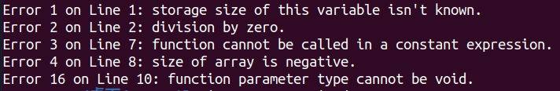


### 5.4 IR生成

我们使用5.2节第1部分的样例（语法正确，包含SysY所有语法细节）对我们的程序进行了测试，结果显示我们的程序能够成功且正确地输出中间代码。**但由于生成结果长达300+行，限于篇幅，我们此处仅通过一些小的样例来展示IR生成的结果。**

#### 样例1

**输入：**

```c
int x = 3;
int b(int x)
{
    return x;
}
int main()
{
    int x=5;
    while(x==1){
        if(!x) {
            int c = b(x);
            break;
        } else {
            x;
        }
        continue;
    }
    return b(x);
}
```

**样例目的：**

测试`if`及`while`循环、`break`及`continue`语句，函数调用、局部变量和全局变量。

**输出：**

```
v1 := #3
FUNCTION b :
PARAM v2
t1 := v2
RETURN t1
FUNCTION main :
v3 := #5
LABEL label1 :
t2 := v3
t3 := #1
IF t2 == t3 GOTO label2
GOTO label3
LABEL label2 :
t4 := #0
t5 := v3
IF t5 != #0 GOTO label7
t4 := #1
LABEL label7 :
IF t4 != #0 GOTO label4
GOTO label5
LABEL label4 :
t6 := v3
ARG t6
v4 := CALL b
GOTO label3
GOTO label6
LABEL label5 :
t7 := v3
LABEL label6 :
GOTO label1
GOTO label1
LABEL label3 :
t9 := v3
ARG t9
t8 := CALL b
RETURN t8
```

**解释：**

第1行的`v1 := #3`对应全局变量定义`int x = 3;`

第2-5行对应`int b(int x)`函数，它首先定义了函数`b`和其参数`x`，然后定义将`x`的值赋给一临时变量并返回。

第6行起对应`int main()`函数。

第7行对应函数内的变量定义`int x=5`。

第8-13、32行对应`while`循环。第9-11行判断变量`x`的值是否为1，若是则执行`label2`之后的部分，否则执行`label3`之后的部分。

第14行开始对应`if`部分。第14-17行计算了`!x`。第19行判断`!x`是否为非0数，若是则跳转到`label4`执行`if`体中的部分，否则跳转到`label5`执行`else`中的部分。第22-24行实现了调用函数`b`的部分。第25行对应`break`语句。第28行执行了语句`x;`，即将x的值赋给一临时变量后不做任何操作。第30行对应`continue`语句。

第33-36行对应`return b(x)`。


#### 样例2

**输入：**

```c
int main()
{
    int i;
    /* else 悬挂 */
    if ( 1 ) 
        if ( 2 ) i = 333;
        else i = 955;
    else if ( 3 ) i = 666;
    else i = 233;
}
```

**样例目的：**

测试`else`悬挂。

**输出：**

```
FUNCTION main :
t1 := #1
IF t1 != #0 GOTO label1
GOTO label2
LABEL label1 :
t2 := #2
IF t2 != #0 GOTO label4
GOTO label5
LABEL label4 :
t3 := #333
v1 := t3
GOTO label6
LABEL label5 :
t4 := #955
v1 := t4
LABEL label6 :
GOTO label3
LABEL label2 :
t5 := #3
IF t5 != #0 GOTO label7
GOTO label8
LABEL label7 :
t6 := #666
v1 := t6
GOTO label9
LABEL label8 :
t7 := #233
v1 := t7
LABEL label9 :
LABEL label3 :
```

**解释：**

第2-4行对应第一个`if`的判断，条件为真时的程序体对应第5-17行，条件为假时的程序体对应第18-29行。

第6-8行对应`if(2)`的判断，条件为真时的程序体对应第9-12行，条件为假时的程序体对应第13-16行。第17行跳转到`label3`退出`if`部分。

第19-21行对应`else if(3)`的判断，条件为真时的程序体对应第22-25行，条件为假时执行`else`部分，对应第26-28行。


#### 样例3

**输入：**

```c
int t=3;
int a(int t)
{
    t=014;
    {   int t = 0x16;
        {   int t = 10;
            {   int t = 0;
                t = t * 10;  // 乘除加减模运算 + 赋值
                t = t / 10;
                t = t + 10;
                t = t - 10;
                t = t % 5;
            }
        }
    }
}
```

**样例目的：**

测试四则运算、不同block中的同名变量、八进制和十六进制数。

**输出：**

```
v1 := #3
FUNCTION a :
PARAM v2
t1 := #12
v2 := t1
v3 := #22
v4 := #10
v5 := #0
t3 := v5
t4 := #10
t2 := t3 * t4
v5 := t2
t6 := v5
t7 := #10
t5 := t6 / t7
v5 := t5
t9 := v5
t10 := #10
t8 := t9 + t10
v5 := t8
t12 := v5
t13 := #10
t11 := t12 - t13
v5 := t11
t15 := v5
t16 := #5
t14 := t15 % t16
v5 := t14
```

**解释：**

第1行对应全局变量`t`，对应的变量名为`v1`。

第3-5行是对函数`a`的参数`t`进行赋值，对应的变量名为`v2`。值为12（八进制数014）。

第6行对应第一个block中的`t`，对应的变量名为`v3`。值为22（十六进制数0x16）。

第7行对应第二个block中的`t`，对应的变量名为`v4`。值为10。

第8行对应第二个block中的`t`，对应的变量名为`v5`。值为0。

第9-28行为运算，分为乘、除、加、减、模共五种运算，每种运算对应4行（获取运算符两边的值、做运算、将结果赋给对应变量）。


#### 样例4

**输入：**

```c
const int z[3][2] = {1, {5}, 8, 9};
```

**样例目的：**

测试数组初始化和常量数组。

**输出：**

```
DEC v1 24
t1 := #1
t2 := v1 + #0
*t2 := t1
t3 := #5
t4 := v1 + #8
*t4 := t3
t5 := #8
t6 := v1 + #16
*t6 := t5
t7 := #9
t8 := v1 + #20
*t8 := t7
```

**解释：**

样例中的数组的初始值应当为`{{1, 0}, {5, 0}, {8, 9}}`。

第1行声明数组，大小为24（数组大小为6个`int`），数组基地址储存在`v1`中。

第2-4行进行赋值，`v[0]=1`。

第5-7行进行赋值，`v[2]=5`。

第8-10行进行赋值，`v[4]=8`。

第11-13行进行赋值，`v[5]=9`。


#### 样例5

**输入：**

```c
const int b = 2;
const int z[3][b] = {1, {5}, 0, b};
```

**样例目的：**

测试数组下标和初值中含有常量的情况。

**输出：**

```
v1 := #2
DEC v2 24
t1 := #1
t2 := v2 + #0
*t2 := t1
t3 := #5
t4 := v2 + #8
*t4 := t3
t5 := #0
t6 := v2 + #16
*t6 := t5
t7 := v1
t8 := v2 + #20
*t8 := t7
```

**解释：**

第1行对常量b赋值。

第2行声明数组大小，由于这里声明的数组大小为（3*2）个`int`，所以IR中声明的大小为24字节。

第3-14行为数组初值的赋值，第3-5行对应`z[0][0]=1`，第6-8行对应`z[1][0]=5`，第9-11行对应`z[2][0]=0`，第12-14行对应`z[3][0]=b`。


#### 样例6

**输入：**

```c
int b(int a[]){
    return a[1];
}
int main(){
    int a[2][2] = {};
    int c = b(a[1]);
}
```

**样例目的：**

测试数组的一部分作为函数参数的情况。

**输出：**

```
FUNCTION b :
PARAM v1
DEC v2 4
t2 := #1
t3 := v2 + #0
*t3 := t2
t5 := #0
t4 := #0 + v2
t4 := *t4
t4 := t4 * #1
t5 := t5 + t4
t5 := t5 * #4
t1 := v1 + t5
t1 := *t1
RETURN t1
FUNCTION main :
DEC v3 16
DEC v5 8
t7 := #1
t8 := v5 + #0
*t8 := t7
t10 := #0
t9 := #0 + v5
t9 := *t9
t9 := t9 * #2
t10 := t10 + t9
t10 := t10 * #4
t6 := v3 + t10
ARG t6
v4 := CALL b
```

**解释：**

可以看到中间代码分为函数`b`（1-15行）和函数`main`两部分（16-30行）。

第`3-6`行是处理`a[1]`的维数，由于`a[1]`只有1维，大小即1，所以令`v2[0]=1`。

第`7-15`行则是计算出`a[1]`的地址，并取其中的值返回。

第`18-21`行是处理`main`函数中的`a[1]`的维数，原理同第`3-6`行。

第`22-28`行则是算出`a[1]`的地址，并作为实参。第`29-30`行调用`b`函数，将返回值储存于`c`（对应`v4`）中。


#### 样例7

**输入：**

```c
int main(){
    int a=1,b=1;
    if(a && b) {
        return 11;
    } else {
        return 22;
    }
}
```

**样例目的：**

测试关系运算符。

**输出：**

```
FUNCTION main :
v1 := #1
v2 := #1
t1 := v1
IF t1 != #0 GOTO label4
GOTO label2
LABEL label4 :
t2 := v2
IF t2 != #0 GOTO label1
GOTO label2
LABEL label1 :
t3 := #11
RETURN t3
GOTO label3
LABEL label2 :
t4 := #22
RETURN t4
LABEL label3 :
```

**解释：**

第`1-2`行对`a`、`b`赋值。

第`4-5`行首先判断`a`是否为非0数（即为真），若是则跳转到`label4`，否则跳转到`label2`（对应`else`内的部分）。在`label4`中，第`8-9`行判断`b`是否为非0数（即为真），若是则跳转到`label1`，否则跳转到`label2`（对应`else`内的部分）。


## 第6章 团队分工

**组长：**黄彦玮

**组员：**田原 鲍奕帆

**具体分工：**

- **Flex+Bison:** 田原、鲍奕帆

- **符号表+类型检查：**田原、黄彦玮

- **IR生成及优化：**鲍奕帆、黄彦玮

- **测试：**黄彦玮

  

本项目采用gitlab进行代码管理，详情见https://gitlab.eduxiji.net/aison/mycompiler.git

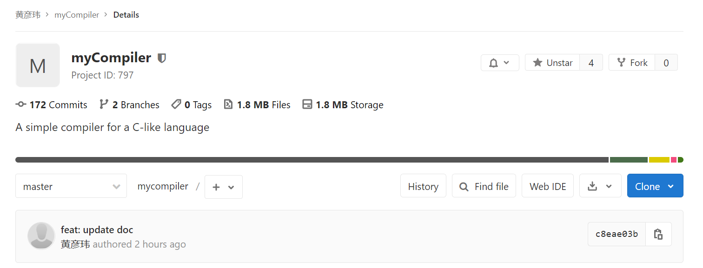


